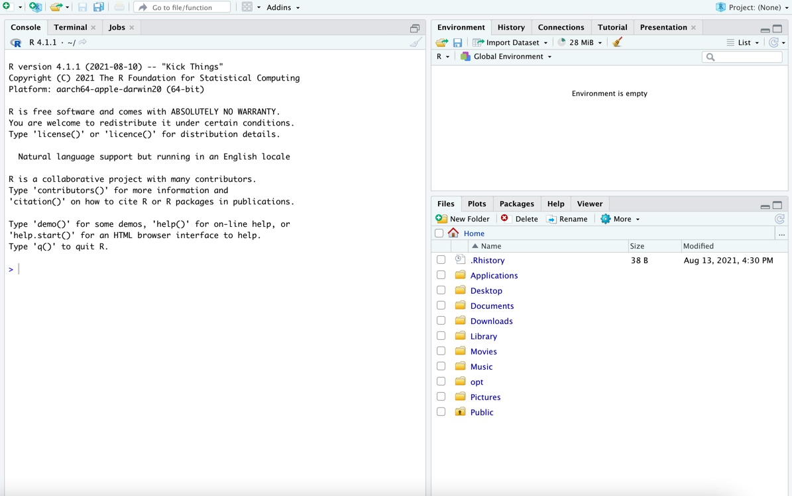

### R and RStudio

In this class, we will use R and RStudio for data analysis, visualization, and reports. R is the statistical software, while RStudio is an environment that makes it easy to manage and use that software. Below are instructions for installing R and RStudio (steps 1--5). Please email me if you have any questions or issues!

1. Install R: go to [this link](https://mirror.las.iastate.edu/CRAN/), and choose the download option for your operating system.

    a. Windows: Click **Download R for Windows**, then click the **install R for the first time** button.
    
    b. macOS: Click **Download R for macOS**. Under *Latest release*, choose the package corresponding to your macOS version.
    
    c. Linux: Click **Download R for Linux**, then select your distro and follow the installation instructions (you will install via the command line).
    
2. Install RStudio: go to [this link](https://posit.co/download/rstudio-desktop/), and scroll down to "All Installers and Tarballs". Download the version corresponding to your computer's OS.
3. Open RStudio (the icon is a white R in a blue circle). You should see something like the following:

4. We'll get acquainted with RStudio in class. For now, let's just check that it works. In the Console, next to the `>`, type `16 * 7` and hit **Enter** (or **return** on Mac). You should get `112`.
5. Finally, we'll do one more setup step. In the console, copy and paste the following lines of code, and hit enter.

```R
install.packages("tinytex")
tinytex::install_tinytex()
```

It may take a few minutes to run. If using macOS, you may need to enter your password in the installation process.

### R Markdown and Quarto

In this class, we will use Quarto documents for homework assignments and projects. If you have used R Markdown before, Quarto is very similar (it just has a few more capabilities). Here we will make sure that Quarto documents can compile on your computer.

First, make sure that the `rmarkdown` package is installed. If not, run the following code in the RStudio Console:

`install.packages("rmarkdown")`

Next, open a new Quarto document (in RStudio: File -> New file -> Quarto document). Click the "Render" button at the top of the screen (this is the equivalent of "knit" for R Markdown documents). 


### Python

There are many ways to install Python. I recommend the [Anaconda](https://www.anaconda.com/download) distribution, available for download on Mac, Windows, or Linux at the link provided. This will download Python and many of the useful libraries for statistics and data science. Full download instructions are available [here](https://docs.anaconda.com/free/anaconda/install/).

To use Python in RStudio, you will also need the `jupyter` Python package. Jupyter should be included in the Anaconda distribution, but you may need to install it if you are using a different Python installation. To check that Jupyter is configured for RStudio and Quarto documents, open a Terminal window and run the following (a Terminal tab can be opened in RStudio through Tools -> Terminal -> Move focus to terminal):

`quarto check jupyter`

(Both checks should read "OK")

To check that Python works with RStudio and Quarto, open the [quarto_test.qmd](https://sta279-f23.github.io/resources/quarto_test.qmd) file. Run each chunk (the green arrow in the top right of the chunk), including the Python chunks at the end. If you are asked to install packages (e.g. `png` or `reticulate`), click "Yes". Finally, Render the quarto_test.qmd file and confirm that it renders without errors. 

Contact Dr. Evans if you encounter any issues with software installation.

